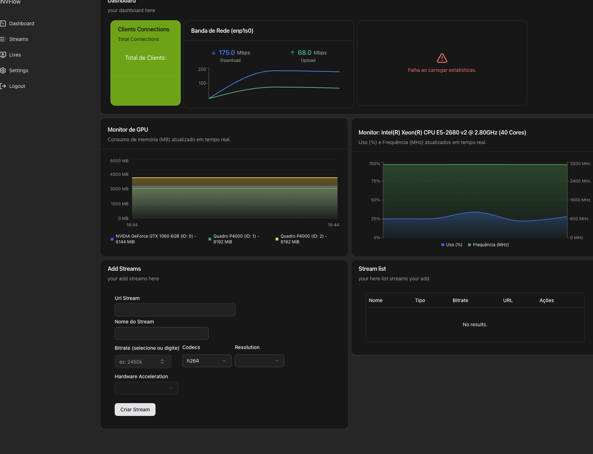

# INVFlow - Gerenciador de Transcodificação de Vídeo para HLS

**INVFlow** é uma aplicação web completa, com back-end e front-end, projetada para simplificar a criação e o gerenciamento de streams de vídeo no formato HLS (HTTP Live Streaming). A solução permite que os usuários forneçam uma URL de fonte de vídeo e configurem opções de transcodificação para gerar um stream ao vivo de forma eficiente e controlada.

O projeto foi desenvolvido com foco em performance e escalabilidade, utilizando uma API em Node.js que se comunica diretamente com uma versão customizada e compilada do FFmpeg pelo desenvolvedor [jeffersonc.dev](https://github.com/jeffersoncdev). O front-end é uma Single Page Application (SPA) moderna e reativa, construída com Vite.js, React e Tailwind CSS.

## � Interface do Projeto

Veja como é o dashboard do INVFlow em execução:



## �🚀 Funcionalidades Principais

O INVFlow oferece um conjunto robusto de funcionalidades para o gerenciamento de transcodificação de vídeo:

### Back-end (API Node.js)

- **API RESTful:** Interface clara e organizada para todas as operações de streaming.
- **Integração com FFmpeg:** Utiliza uma compilação própria do FFmpeg para otimizar o processo de transcodificação.
- **Geração de HLS:** Recebe uma URL de fonte de vídeo (`font url`) e gera um manifesto `.m3u8` e segmentos de vídeo `.ts`.
- **Configurações de Transcodificação:** Permite o ajuste de parâmetros como bitrate, resolução, codecs de áudio e vídeo, entre outros.
- **Gerenciamento de Processos:** Controla a execução dos processos do FFmpeg, permitindo iniciar, parar e monitorar cada stream individualmente.

### Front-end (Dashboard React)

- **Dashboard Intuitivo:** Interface amigável para visualizar e gerenciar todos os streams ativos e inativos.
- **Criação Simplificada:** Formulário para criar novos streams, inserindo a URL da fonte e selecionando as opções de transcodificação desejadas.
- **Listagem de Streams:** Visualização em tempo real de todos os streams, com seus respectivos status (ativo, inativo, com erro).
- **Controle Total:** Botões para iniciar, parar todos os streams de uma vez ou controlar cada um individualmente.
- **Design Responsivo:** Interface construída com Tailwind CSS, totalmente adaptável a diferentes tamanhos de tela.

## 🛠️ Tecnologias Utilizadas

O INVFlow foi construído com uma stack de tecnologias modernas e performáticas, tanto no back-end quanto no front-end.

### Servidor (Back-end)

- **[Node.js](https://nodejs.org/)**: Ambiente de execução JavaScript assíncrono, ideal para operações de I/O intensas como o streaming.
- **[Fastify](https://www.fastify.io/)**: Framework web de alta performance e baixo overhead, focado em velocidade e eficiência.
- **[FFmpeg](https://ffmpeg.org/)**: A principal ferramenta para transcodificação de vídeo, utilizada em uma versão customizada para otimizações.
- **[zod](https://zod.dev/)**: validador de tipos dados em input ou output.
- **[TypeScript](https://www.typescriptlang.org/)**: Superset do JavaScript que adiciona tipagem estática, aumentando a robustez e a manutenibilidade do código da API.

### Web (Front-end)

- **Vite**: Ferramenta de build de última geração que oferece um desenvolvimento extremamente rápido com Hot Module Replacement (HMR).
- **React**: Biblioteca para a construção de interfaces de usuário dinâmicas e reativas.
- **React Router DOM**: Para o gerenciamento de rotas do lado do cliente em uma Single Page Application (SPA).
- **Tailwind CSS**: Framework CSS utility-first que permite a criação de designs customizados de forma rápida e eficiente.
- **React Query**: Cliente HTTP baseado em Promises para realizar requisições à API do back-end.
- **TypeScript**: Garante um código mais seguro e previsível no front-end, facilitando a integração com a API.

## 📦 Instalação e Configuração

Siga os passos abaixo para configurar e executar o ambiente de desenvolvimento do INVFlow.

### Pré-requisitos

- [Node.js](https://nodejs.org/) (versão 18.x ou superior)
- [npm](https://www.npmjs.com/) ou [Yarn](https://yarnpkg.com/)
- FFmpeg (a versão customizada por jeffersonc.dev deve estar disponível no ambiente do back-end)

### Configurando o Back-end

1.  Clone o repositório:
    ```bash
    git clone [https://github.com/seu-usuario/invflow.git](https://github.com/seu-usuario/invflow.git)
    ```
2.  Navegue até o diretório do back-end:
    ```bash
    cd invflow/backend
    ```
3.  Instale as dependências:
    ```bash
    npm install
    ```
4.  Configure as variáveis de ambiente. Crie um arquivo `.env` a partir do `.env.example` e adicione as configurações necessárias, como a porta da API e o caminho para o executável do FFmpeg.

    ```env
    PORT=3333
    FFMPEG_PATH=/caminho/para/seu/ffmpeg
    ```

    4.1 o server tem uma pasta bin se vc compilar sua versão e colocar nela o sistema automaticamente vai pegar de la o ffmpeg

5.  Inicie o servidor de desenvolvimento:
    ```bash
    npm run dev
    ```

### Configurando o Front-end

1.  Navegue até o diretório do front-end:
    ```bash
    cd invflow/frontend
    ```
2.  Instale as dependências:
    ```bash
    npm install
    ```
3.  Configure a URL da API no seu ambiente. Crie um arquivo `.env` e defina a variável:
    ```env
    VITE_API_BASE_URL=http://localhost:3333
    ```
4.  Inicie o servidor de desenvolvimento:
    ```bash
    npm run dev
    ```

Após seguir esses passos, a aplicação estará acessível em `http://localhost:5173` (ou a porta que o Vite definir).

## 🚀 Como Usar

1.  Acesse o dashboard no seu navegador.
2.  Clique em **"Criar Novo Stream"**.
3.  Preencha o formulário com a **URL da fonte** do vídeo (ex: uma URL de um stream RTSP, RTMP ou um arquivo de vídeo).
4.  Selecione as **opções de transcodificação** desejadas.
5.  Clique em **"Iniciar Stream"**.
6.  O novo stream aparecerá na lista do dashboard, onde você poderá monitorá-lo e gerenciá-lo.

## 👨‍💻 Desenvolvedor

Este projeto foi idealizado e desenvolvido por **Jefferson Charlles**.

- **GitHub:** [@jeffersoncharlles](https://github.com/jeffersoncharlles)
- **Website:** [jeffersonc.dev](https://jefferdeveloper.com)

## 🤝 Contribuições

Contribuições são bem-vindas! Se você tiver ideias para melhorias, correções de bugs ou novas funcionalidades, sinta-se à vontade para abrir uma _issue_ ou enviar um _pull request_.
